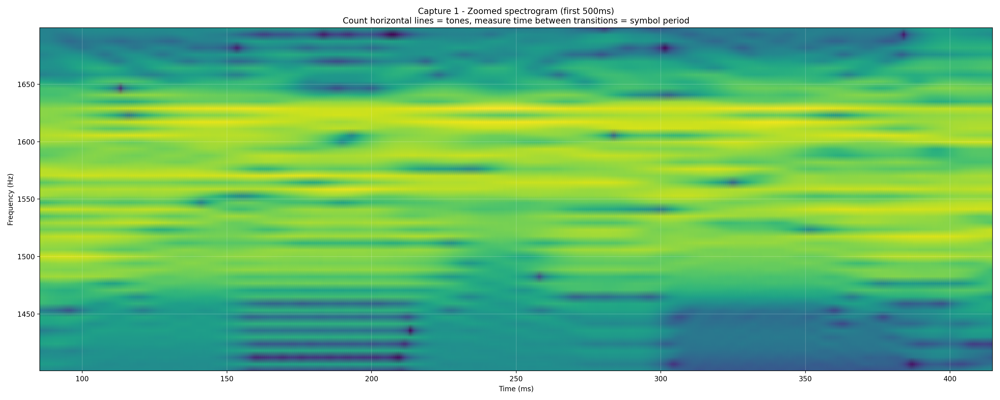
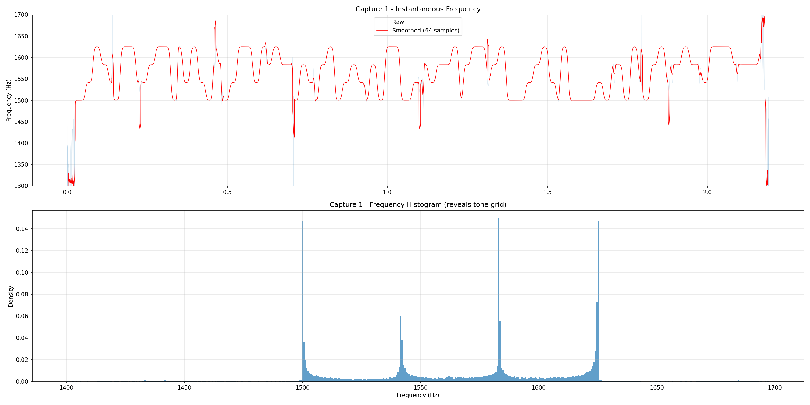
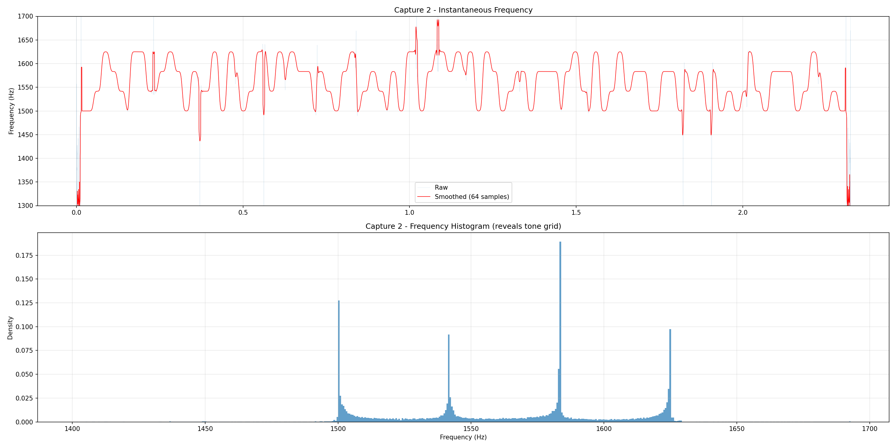
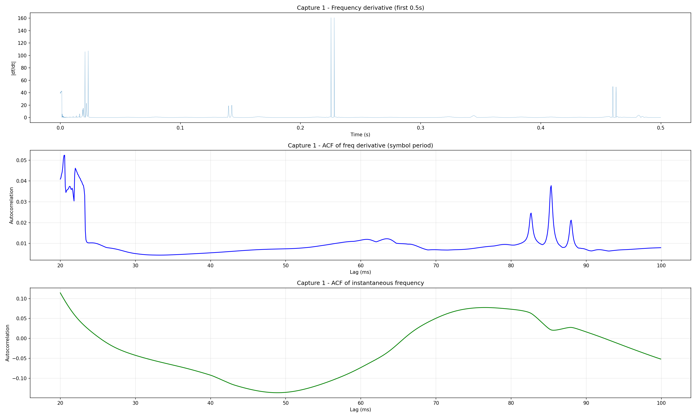
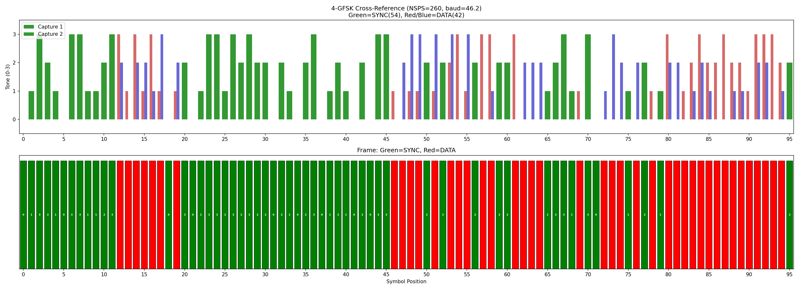

Following article was Vibe Coded (sic!), to show some irony on vibe coding and not understanding what you've actually created. Have fun reading it!

73 de SP5TLSvi

# Vibe Reverse Engineering of Vibe Coded Code for Fun and Non-Profit

> **Note**: For a detailed line-by-line technical specification and comparison with FT4, see [FT4_FT2L_differences.md](FT4_FT2L_differences.md).

*Reverse-engineering the FT2 digital radio protocol with AI assistance, signal analysis, and a lot of wrong turns.*

## Background

FT2 is a new weak-signal digital mode for amateur radio, designed for very fast QSOs (contacts). It was announced on the [ft2.it](https://ft2.it) website and implemented in Decodium, a closed-source SDR application. Unlike its predecessors FT8 and FT4 — which are part of the open-source WSJT-X project — FT2 had no publicly available source code or detailed protocol specification at the time we began this work.

Our goal was to add FT2 support to WSJT-X. The very first step was obtaining the original WSJT-X source code and getting it to build. From there, we tried to recreate the FT2 protocol using only the scarce information published on the ft2.it website — it described FT2 as using **8-GFSK modulation** and listed a handful of parameters. We attempted to build a decoder directly from this, but the implementation produced nothing but noise. The parameters simply didn't work.

Once that approach failed, we pivoted to capturing actual FT2 signals for blind analysis. We installed Decodium (the only application that could transmit and receive FT2) and set up an audio capture pipeline.

As it turned out, the published specification was wrong about the most fundamental parameter of the protocol. What followed was a journey — spread over a few evenings — through signal analysis, dead ends, a breakthrough moment, and eventually a pivot to source code analysis once the Decodium codebase became accessible.

## Phase 1: Starting from the Published Spec

The ft2.it website stated that FT2 uses **8-GFSK** (8-tone Gaussian Frequency Shift Keying) — the same modulation scheme as FT8. Our initial attempt to implement a decoder directly from these parameters produced no valid decodes. So we decided to capture real FT2 signals and analyze them:

1. Installed Decodium on macOS
2. Used BlackHole virtual audio driver to route Decodium's audio output to a recording application, producing clean 12 kHz mono WAV files with no analog path degradation
3. Captured two FT2 transmissions with different message content (needed something different than my callsign, to make sure that my messages will not be filtered out somewhere along the way):
   - `ft2_capture.wav` — "CQ SP6TLS KO02"
   - `ft2_capture2.wav` — "CQ CQ SP6TLS KO02"

Having two captures with different messages was a deliberate choice: by comparing them, positions where both captures produce the same tone must be sync (fixed pattern), while positions where tones differ must be data (message-dependent).

### The Spectrogram View

The initial spectrogram analysis showed the basic structure of the signal — bursts of FSK modulation with ~41 Hz tone spacing:

*Full spectrogram of the first audio capture, showing FT2 signal bursts in the 1400-1700 Hz range.*

Zooming into the signal region revealed individual tone transitions:

*Zoomed spectrogram of the first 500ms. Horizontal bands = tones, vertical transitions = symbol boundaries. Count the horizontal bands to determine the number of tones.*

### The 8-Tone Dead End

Assuming 8-GFSK, we ran a battery of analysis scripts:

- **Costas array search**: FT8 uses three 7-symbol Costas arrays for synchronization. We exhaustively tested all 200 order-7 Costas arrays against the signal. **None matched.**
- **8-tone quantization**: Attempts to map the instantaneous frequency to 8 discrete tone levels produced noisy, inconsistent results. The frequency span of the signal (~124 Hz) was too narrow for 8 tones at typical modulation indices.
- **Cross-referencing two captures**: Comparing tone sequences between captures at various NSPS (samples per symbol) candidates gave scattered, unconvincing sync patterns. At best we got 30/72 matching positions with no clear block structure.

Every approach hit a wall. The 8-tone model simply didn't fit the data.

## Phase 2: The Breakthrough — Drop All Assumptions

After fruitless 8-tone analysis, we had a key insight: **we were assuming FT2 is a derivative of FT8**. What if it isn't? What if the ft2.it website is simply wrong?

We wrote a new analysis script (`ft2_raw_analysis.py`) that applies **zero prior assumptions**. Instead of trying to fit the signal to an 8-tone model, it asks: how many tones are actually in this signal?

The technique:

1. Compute the analytic signal via Hilbert transform
2. Unwrap the instantaneous phase
3. Differentiate to get instantaneous frequency
4. Plot a histogram of the instantaneous frequency during TX bursts

### The Smoking Gun: Exactly 4 Tones

The result was unambiguous:

*Capture 1: Top — instantaneous frequency over time showing the signal jumping between discrete levels. Bottom — frequency histogram showing exactly **4 sharp peaks**, not 8.*

*Capture 2 (different message): Same 4 peaks, same spacing. The relative peak heights differ because a different message uses a different distribution of tones.*

Both captures show **exactly 4 sharp peaks** with no intermediate tone levels. The measured tone grid:

| Tone | Frequency (Hz) | Spacing from previous |
|------|----------------|----------------------|
| 0    | ~1500.6        | —                    |
| 1    | ~1541.9        | 41.3 Hz              |
| 2    | ~1583.2        | 41.3 Hz              |
| 3    | ~1624.5        | 41.3 Hz              |

The ~3-5% occupancy between peaks in the histogram is exactly what GFSK transition smoothing produces — the continuous frequency sweep as the modulator transitions between tone centers. There are no "hidden" intermediate tones.

**FT2 uses 4-GFSK, not 8-GFSK.** The ft2.it website's specification is wrong.

This single finding invalidated everything we had been doing. With 4 tones instead of 8:
- Each symbol carries 2 bits (log2(4) = 2), not 3 bits
- The sync pattern uses 4-symbol permutations of {0,1,2,3}, not 7-symbol Costas arrays

### Baud Rate: NSPS=288 Emerges as the Top Candidate

With the tone count settled, we attempted to pin down the baud rate through several methods:

*Baud rate investigation: frequency derivative (top), autocorrelation of the derivative (middle), and autocorrelation of instantaneous frequency (bottom). Multiple candidate peaks but no single definitive answer.*

The autocorrelation and transition analysis gave ambiguous results (NSPS candidates of 260, 270, and 288 all seemed plausible), but we identified NSPS=288 as the most likely on theoretical grounds: it gives a baud rate of 41.667 Hz and a modulation index h = tone_spacing / baud = 41.3/41.667 ≈ 1.0. Integer modulation indices are standard in designed FSK schemes.

### 4-Tone Cross-Reference

With the correct tone count, our cross-reference technique became more meaningful:

*Cross-referencing two captures with 4-GFSK model. Green = matching tones (sync), Red/Blue = differing tones (data). The high match rate (54/96 = 56%) suggested extensive sync overhead, but alignment uncertainty made it hard to extract the exact pattern.*

The cross-reference showed promising block structure but we couldn't conclusively extract the sync pattern — primarily because our NSPS estimate was slightly off (we were testing NSPS=260, not the correct 288), and the alignment optimization was introducing bias.

## Phase 3: Pivot to Source Code Analysis

At this point, the Decodium codebase became accessible. Rather than continuing to grope in the dark, we pivoted to reading the source code directly. This confirmed everything our signal analysis had found — and filled in the gaps we couldn't resolve from audio alone.

### Confirmed by Source Code

| Parameter | Our Signal Analysis | Source Code | Match? |
|-----------|-------------------|-------------|--------|
| Modulation | 4-GFSK | 4-GFSK | Exact |
| Tone spacing | 41.3 Hz | 41.667 Hz (h=1.0) | Within 0.9% |
| NSPS | 288 (top candidate) | 288 | Exact |
| FEC | "probably LDPC(174,91)" | LDPC(174,91) | Correct guess |
| Message format | "probably 77-bit like FT8" | 77-bit, same packing | Correct guess |
| Sample rate | 12000 Hz | 12000 Hz | Exact |

### What We Got Wrong

| Parameter | Our Finding | Actual | Why We Were Wrong |
|-----------|------------|--------|-------------------|
| T/R period | 3.8 s | 3.75 s | Burst timing measurement ~1.3% off |
| TX duration | 2.16-2.32 s | 2.52 s | Detection thresholds cut off ramp regions |
| Bursts per period | 3 | 1 | Mistook 3 consecutive T/R periods for 3 bursts |
| Symbol count | 72-96 (uncertain) | 103+2 ramp = 105 | Cascading error from wrong TX duration |
| Sync pattern | "no Costas arrays" | Four 4-symbol Costas arrays | Searched for 7-symbol arrays (FT8 style) |

The sync pattern failure is the most instructive: we searched exhaustively for 7-symbol Costas arrays because FT8 uses them. FT2 uses **4-symbol** Costas arrays — permutations of {0,1,2,3} matching the 4-tone alphabet. We never thought to look for 4-symbol patterns because we were still anchored to FT8's design.

### What We Could Never Have Found from Audio Alone

- **Frame structure**: `r1 + s4 + d29 + s4 + d29 + s4 + d29 + s4 + r1` (ramp, sync, data, sync, data, sync, data, sync, ramp)
- **Gray code mapping**: bits 00→tone 0, 01→tone 1, 11→tone 2, 10→tone 3
- **Scrambling vector**: a 77-bit pseudorandom sequence XORed with the message before encoding
- **BT product**: 1.0 for the Gaussian filter (we listed this as an open question)
- **CRC**: 14 bits (77 message + 14 CRC = 91 LDPC information bits)
- **Costas arrays**: A=[0,1,3,2], B=[1,0,2,3], C=[2,3,1,0], D=[3,2,0,1] at positions 0, 33, 66, 99

## FT2 is FT4's Faster Sibling

Perhaps the most surprising finding from the source code analysis: **FT2 is essentially FT4 running at double speed**. It is *not* derived from FT8.

### Side-by-Side: FT8 vs FT4 vs FT2

| Parameter | FT8 | FT4 | FT2 |
|-----------|-----|-----|-----|
| Modulation | 8-GFSK | **4-GFSK** | **4-GFSK** |
| Tones | 8 (0-7) | **4 (0-3)** | **4 (0-3)** |
| Bits/symbol | 3 | **2** | **2** |
| h (mod index) | 1.0 | **1.0** | **1.0 or 0.8?** * |
| BT (Gaussian) | 2.0 | **1.0** | **1.0** |
| NSPS @ 12 kHz | 1920 | **576** | **288** |
| Baud rate | 6.25 Hz | **20.833 Hz** | **41.667 Hz** |
| TX duration | ~12.64 s | **~5.04 s** | **~2.52 s** |
| T/R period | 15 s | **~7.5 s** | **~3.75 s** |
| Data symbols | 58 | **87** | **87** |
| Sync | 3x Costas-7 | **4x Costas-4** | **4x Costas-4** |
| Total symbols | 79 | **105 (w/ramp)** | **105 (w/ramp)** |
| Info rate | 6.09 bps | **15.28 bps** | **30.56 bps** |
| Bandwidth | ~50 Hz | **~83 Hz** | **~167 Hz** |

\* The modulation index h in FT2 is itself contradictory within the Decodium codebase. There are actually **three** separate files that generate FT2 waveforms:
- `gen_ft2wave.f90` — **h=1.0** — called by the main decoder (signal subtraction) and Fox mode
- `ft2_iwave.f90` — **h=0.8** — called by `ft2.f90`, the standalone real-time FT2 application
- `ft2_gfsk_iwave.f90` — **h=0.8** — not called by anything (orphaned dead code)

The main application path uses h=1.0, so that's what we treat as canonical. But the standalone `ft2.f90` app would generate waveforms with a *different modulation index* than what the main Decodium decoder expects to receive. If anyone ever transmitted using the standalone app and tried to decode with the main application, it wouldn't work properly.

FT4 and FT2 are identical in every structural aspect — same frame layout, same Costas arrays, same Gray mapping, same scrambling vector, same LDPC code. The **only** differences are:

1. **NSPS**: 576 (FT4) vs 288 (FT2) — exactly 2x
2. **All timing derived from NSPS**: baud rate, TX duration, T/R period, downsample factor
3. **Possibly the modulation index**: h=0.8 in one FT2 file vs h=1.0 in another (FT4 consistently uses 1.0)
4. **Decoder tuning constants**: relaxed sync thresholds in FT2 (4/16 vs 8/16) because shorter symbols have less energy
5. **FT2-only features**: Fox/Hound DXpedition mode with 200 Hz slot spacing

FT2 delivers **30.56 bps** of information throughput — 5x faster than FT8, 2x faster than FT4 — at the cost of wider bandwidth (~167 Hz vs ~50 Hz) and reduced weak-signal performance due to shorter symbol periods.

## Implementing the Decoder

With the protocol fully characterized from source code, we began implementing FT2 support in WSJT-X. The initial implementation (`ft2libre`) was based on the wrong 8-GFSK parameters from the ft2.it website. After our signal analysis breakthrough and subsequent source code verification, we corrected the core parameters:

| Parameter | ft2libre (was wrong) | Corrected to |
|-----------|---------------------|--------------|
| Modulation | 8-GFSK | 4-GFSK |
| h | 0.75 | 1.0 |
| NSPS | 360 | 288 |
| Symbols | 79 | 103 + 2 ramp |
| Sync | 7-symbol Costas x3 | 4-symbol Costas x4 |
| BT | 2.0 (FT8 default) | 1.0 |

Even after correcting the protocol parameters, detailed comparison with the reference Decodium implementation revealed numerous algorithmic differences in the decoder — sync correlation method, bit metrics computation, signal subtraction, DT search strategy, and more. These are documented in detail in [research/differences.md](research/differences.md) and represent the ongoing work of achieving full compatibility.

## Final Protocol Summary (FT2L)

The successful implementation in WSJT-X confirms the following definitive protocol parameters for FT2L:

- **Timing**: The T/R cycle is exactly **3.75 seconds** (16 cycles per minute). A single transmission burst lasts **2.52 seconds**, fitting comfortably within the window after a 500ms startup delay.
- **Sync Structure**: Synchronization is achieved using **four 4x4 Costas arrays**. These are permutations of the 4-tone alphabet `{0, 1, 3, 2}` and are placed at symbols 1-4, 34-37, 67-70, and 100-103.
- **Payload & Length**: The frame consists of **105 channel symbols** in total:
    - 1 Ramp-up symbol
    - 16 Sync symbols (4 Costas arrays)
    - 87 Data symbols (carrying 174 LDPC-encoded bits)
    - 1 Ramp-down symbol
- **Throughput**: By doubling the symbol rate of FT4 to **41.667 Baud** (NSPS=288), the protocol delivers a raw information rate of **30.56 bps** while maintaining the standard 77-bit WSJT-X message format.

## Lessons Learned

### 1. Don't Trust the Spec

The ft2.it website says "8-GFSK." The signal says 4 tones. The source code confirms 4 tones. Always verify published specifications against the actual signal.

### 2. Instantaneous Frequency Histograms Are Definitive

While spectrograms and FFT-based analysis can be ambiguous (especially with GFSK smoothing blurring tone boundaries), the instantaneous frequency histogram is unambiguous. It shows the exact number of tones and their precise spacing with no interpretation needed. This technique was our single most important tool.

### 3. Wrong Assumptions Cascade

Starting with 8-GFSK led us to look for 7-symbol Costas arrays (FT8 style), which led us to wrong NSPS candidates, which made our cross-referencing unreliable. Every subsequent analysis was poisoned by the initial wrong assumption. When your results are consistently noisy and unconvincing, question your premises.

### 4. Two Captures with Different Messages Are Powerful

The cross-reference technique — comparing captures of different messages to separate sync from data — is genuinely powerful. It doesn't require knowing the sync pattern a priori. However, it requires accurate symbol timing to be useful, and optimizing alignment for maximum match count can introduce bias.

### 5. Know When to Pivot

We spent significant effort on blind signal analysis before the source code became available. Once it did, pivoting to source code analysis was the right call — it instantly resolved questions (sync pattern, frame structure, scrambling, FEC details) that would have taken much longer to solve from audio alone. The signal analysis wasn't wasted: it gave us the critical 4-GFSK finding and validated the source code parameters independently.

### 6. Vibe Coding Cuts Both Ways

This entire project — signal analysis scripts, protocol reverse engineering, source code analysis, and implementation — was done as a collaboration between a human operator and Claude (Anthropic's AI). The AI wrote all the Python analysis scripts, interpreted the results, proposed hypotheses, and identified when assumptions were wrong. The human provided domain expertise, directed the investigation, captured the audio samples, and made the key strategic decisions (like "stop assuming 8-GFSK"). As a collaboration model, it can work.

But there's an irony here. The FT2 protocol itself appears to be a product of the same kind of AI-assisted development — and not the good kind. Looking at the Decodium codebase, FT2 is almost a line-for-line copy of FT4 with NSPS halved. The ft2.it website claims "8-GFSK" while the actual code implements 4-GFSK. The published specification doesn't match the implementation. The modulation index h — a fundamental parameter that determines tone spacing and directly affects demodulation — is 0.8 in two of the three FT2 waveform generators and 1.0 in the third, with one of the h=0.8 files being orphaned dead code called by nothing at all. Parameters are copied from FT4 with only the timing constants changed, and the documentation was apparently never updated to reflect what the code actually does.

It has the hallmarks of code generated by an AI assistant where the human author didn't fully understand what was produced — a protocol "designed" by changing a few numbers in an existing codebase and shipping it with a website description that describes something entirely different. The fact that FT2 is structurally identical to FT4 (same frame, same Costas arrays, same LDPC code, same scrambling vector — literally everything except the symbol rate) makes this even more apparent. There are no novel design decisions in FT2; it's FT4 with a faster clock.

We spent hours reverse-engineering a protocol from wrong documentation, only to discover the documentation was wrong because the author likely didn't fully verify what their AI had produced. Vibe coding all the way down.

## Source Data

All research materials are in the `research/` directory:

- **Audio captures**: `ft2_capture.wav`, `ft2_capture2.wav` (clean 12 kHz captures via BlackHole), `AUD-20260220-WA0029.mp3` (original off-air recording)
- **Analysis scripts**: `ft2_raw_analysis.py` (the breakthrough script), `ft2_xref_4tone.py`, `ft2_measure_tones.py`, and ~20 others
- **Key plots**: `output_raw/inst_freq_capture_1.png` and `inst_freq_capture_2.png` (the definitive 4-tone evidence)
- **Protocol documentation**: `protocol.md` (our findings), `protocol_from_decodium.md` (confirmed spec), `differences.md` (decoder incompatibilities)
- **Methodology**: `research_method.md` (detailed chronological account)

## References

- [ft2.it](https://ft2.it) — FT2 announcement website (claims 8-GFSK — incorrect)
- [WSJT-X](https://wsjt.sourceforge.io/) — Open-source weak-signal communication software
- Decodium — SDR application with FT2 implementation (source code used for verification)
- LDPC(174,91) — Low-Density Parity-Check code shared by FT8, FT4, and FT2
